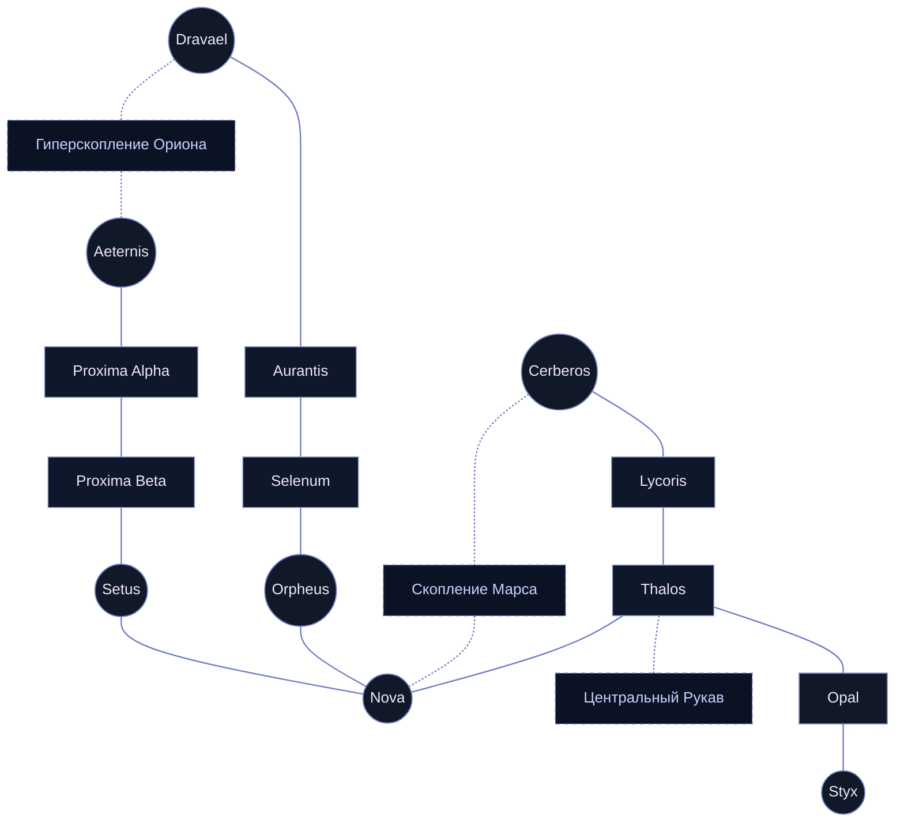

# Скопление Геи

Схема коридоров Серебряной сети в пределах Скопления Геи.  

```mermaid
flowchart TB
  %% =====================================================
  %%   primary ~ #5c6bc0, dark ~ #3949ab, lightest ~ #b388ff
  %% =====================================================

  %% Nodes
  classDef star fill:#111827,stroke:#7986cb,color:#ede7f6,stroke-width:1.2px;
  classDef relay fill:#0f172a,stroke:#9fa8da,color:#ede7f6,stroke-width:1px;
  classDef out fill:#0b1224,stroke:#5c6bc0,color:#c7d2fe,stroke-dasharray: 5 4;

  %% Links (Silver Net)
  linkStyle default stroke:#5c6bc0,stroke-width:1.4px,opacity:0.9;

  %% ===== Center =====
  N((Nova)):::star

  %% ===== Left arm =====
  OUT_A["Гиперскопление Ориона"]:::out
  A((Aeternis)):::star
  PA[Proxima Alpha]:::relay
  PB[Proxima Beta]:::relay
  S((Setus)):::star

  D -.- OUT_A -.- A
  A --- PA --- PB --- S
  S --- N

  %% ===== Bottom arm =====
  D((Dravael)):::star
  AU[Aurantis]:::relay
  SE[Selenum]:::relay
  O((Orpheus)):::star

  D --- AU --- SE --- O
  O --- N

  %% ===== Right arm =====
  OUT_C["Скопление Марса"]:::out
  OUT_D["Центральный Рукав"]:::out

  C((Cerberos)):::star
  L[Lycoris]:::relay
  T[Thalos]:::relay
  ST((Styx)):::star
  OPA[Opal]:::star

  C -.- OUT_C -.- N
  C --- L --- T
  T --- N
  T -.- OUT_D

  T --- OPA --- ST

  %% Clickable nodes (with baseUrl)
  click N "/homo-dominus/миры/Нова/" "Открыть: Нова"
  click A "/homo-dominus/миры/Аэтернис/" "Открыть: Аэтернис"
  click S "/homo-dominus/миры/Сетус/" "Открыть: Сетус"
  click D "/homo-dominus/миры/Драваэль/" "Открыть: Драваэль"
  click O "/homo-dominus/миры/Орфей/" "Открыть: Орфей"
  click C "/homo-dominus/миры/Керберос/Соларет" "Открыть: Керберос"
  click ST "/homo-dominus/миры/Стикс" "Открыть: Керберос"
```